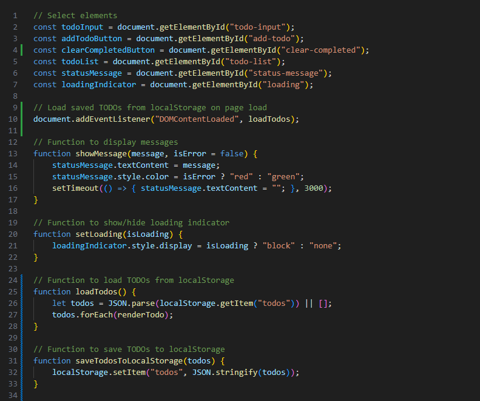
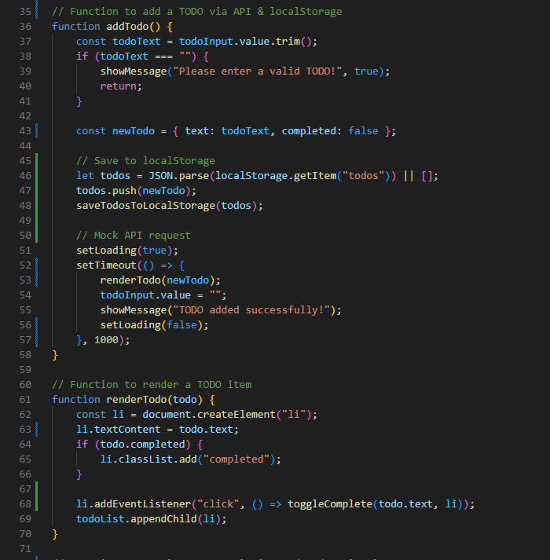
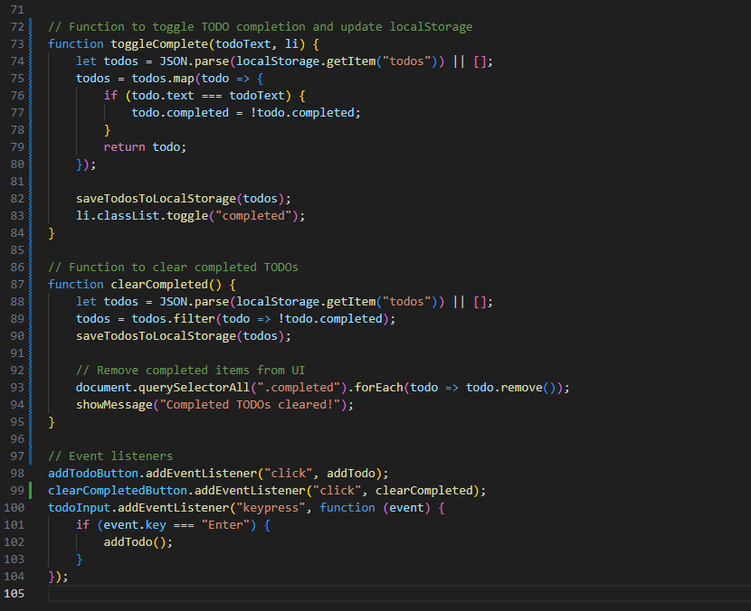

# Lesson 11: The Final TODO App

## 🎯 Objectives
By the end of this lesson, you will:
- **Finalise your TODO app** with all the features built in previous lessons.
- **Ensure TODOs persist** in `localStorage` even after a page refresh.
- **Store new TODOs** in both localStorage and a mock API.
- **Mark TODOs as complete and maintain their state after refresh.**
- **Clear completed TODOs** from the list and localStorage.
- **Deploy the app** using GitHub Pages and share your live project!

---

## 📂 Final Folder Structure
Unlike previous lessons where each step had separate folders, you will now work in **one evolving project directory**:
```
/todo-app/
  ├── index.html
  ├── style.css
  ├── script.js
  ├── README.md
```
Each lesson **modifies or expands** this same project.

---

## 🛠️ **Step 1: Ensure Your `index.html` is Complete**
Ensure your `index.html` includes all necessary elements:
```html
<!DOCTYPE html>
<html lang="en">
<head>
    <meta charset="UTF-8">
    <meta name="viewport" content="width=device-width, initial-scale=1.0">
    <title>TODO App</title>
    <link rel="stylesheet" href="style.css">
</head>
<body>
    <h1>TODO App</h1>
    <p id="status-message"></p>
    <div id="loading" style="display: none;">Loading...</div>
    <input type="text" id="todo-input" placeholder="Enter a new TODO">
    <button id="add-todo">Add TODO</button>
    <button id="clear-completed">Clear Completed</button>
    <ul id="todo-list"></ul>
    <script src="script.js"></script>
</body>
</html>
```

---

## 🎨 **Step 2: Ensure Your `style.css` is Complete**
```css
body {
    font-family: Arial, sans-serif;
    text-align: center;
}

#status-message {
    font-weight: bold;
    margin-bottom: 10px;
}

#loading {
    font-style: italic;
    color: blue;
}

#todo-input {
    padding: 10px;
    width: 250px;
    margin-right: 10px;
}

#add-todo, #clear-completed {
    padding: 10px 15px;
    cursor: pointer;
    margin: 5px;
}

ul {
    list-style: none;
    padding: 0;
    max-width: 300px;
    margin: 20px auto;
}

li {
    background: #f4f4f4;
    padding: 10px;
    margin-top: 5px;
    border-radius: 5px;
    display: flex;
    justify-content: space-between;
    align-items: center;
}

.completed {
    text-decoration: line-through;
    color: gray;
    opacity: 0.7;
}

button {
    margin-left: 10px;
    cursor: pointer;
}
```

---

## 💻 **Step 3: Ensure Your `script.js` is Complete**
This final script ensures:

✅ Previously saved TODOs **load from `localStorage` on page load**.

✅ New TODOs **save to both localStorage and a mock API**.

✅ **Completed TODOs remain completed** even after a page refresh.

✅ **Users can clear completed TODOs** from both UI and localStorage.







# Final Step: Deploy Your App on GitHub Pages


## 🚀 **Step 1: Push Your Code to GitHub**
1. Open a terminal and navigate to your project folder:
   ```sh
   cd path/to/todo-app-lessons
   ```
2. Ensure all changes are committed:
   ```sh
   git add .
   git commit -m "Final version - ready for deployment"
   ```
3. Push your code to GitHub:
   ```sh
   git push origin main
   ```

---

## 🌍 **Step 2: Enable GitHub Pages**
1. Go to your repository on **GitHub**.
2. Click on **Settings** > **Pages**.
3. Under **Branch**, select `main` (or your default branch).
4. Click **Save**.
5. Wait a few minutes, then access your live app at:
   ```
   https://your-username.github.io/todo-app-lessons/
   ```

---

## ✅ **Your Task**
✅ Enable **GitHub Pages** for your project.  
✅ Test your deployed TODO app.  
✅ Share your **GitHub Pages link** with others!

---

## ⚡ **Bonus Challenge**
- Add a **custom domain** to your GitHub Pages site.
- Improve the **UI design** before deployment.
- Create a **README section** with instructions on how to use the app.

---

## 👀 **Previewing Your Work**
1. Visit your **GitHub Pages URL**.
2. Test the TODO app in a browser.
3. Ensure all features work as expected.

---

## 🎯 **Expected Outcome**
By the end of this lesson:
✅ Your TODO app is **live on the internet**.  
✅ The GitHub Pages **link is working**.  
✅ You can **share your project** with others.

---

## ✅ **Mark Lesson 11 as Complete!**
Once you have successfully deployed your app:
- **Celebrate! 🎉** You've built and deployed a full TODO app!
- Share your **GitHub Pages link** with classmates or instructors.

---

🎉 **Congratulations! You have completed the TODO App Lessons!** 🎉

Happy Coding! 🚀

